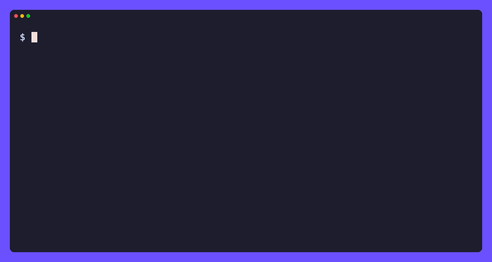
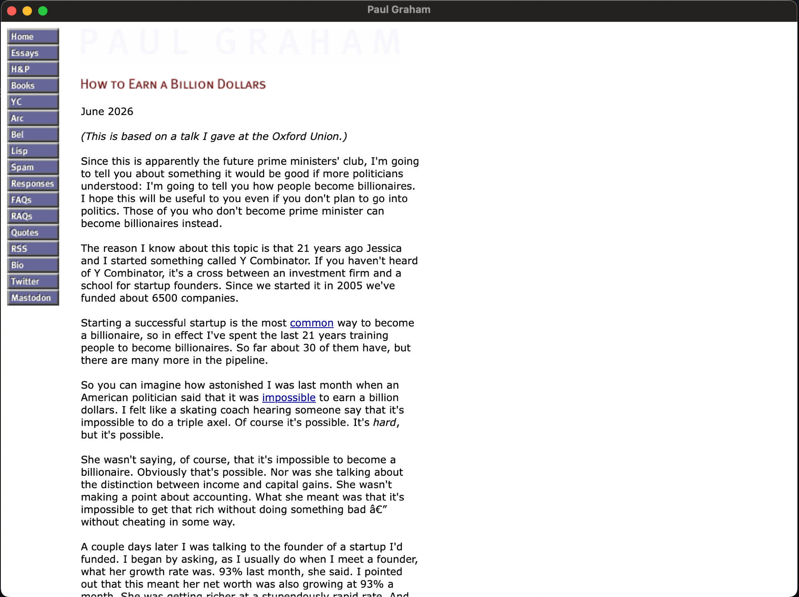

# kage

[](https://github.com/tamnd/kage/actions/workflows/ci.yml)
[](https://github.com/tamnd/kage/releases/latest)
[](https://pkg.go.dev/github.com/tamnd/kage)
[](https://goreportcard.com/report/github.com/tamnd/kage)
[](./LICENSE)

**kage** (影, "shadow") clones a website into a folder you can browse offline, with every script stripped out. It opens each page in real headless Chrome, waits for the page to settle, snapshots the DOM a human would have seen, then deletes all the JavaScript and pulls the CSS, images, and fonts down to local paths. What lands on disk looks like the live site and runs no code.

[Install](#install) • [Quick start](#quick-start) • [Commands](#commands) • [Clone](#clone) • [Pack](#pack-it-into-one-file) • [Native window](#a-real-window-not-a-browser-tab) • [How it works](#how-it-works)



You already know the problem. You hit "Save As" on a page you want to keep, and six months later you open it to find a blank screen, a spinner that never stops, or a copy that still tries to phone home to an analytics server that no longer exists. The page was never really yours. It was a thin client for someone else's JavaScript.

kage takes the other road. It drives a real browser, lets the page finish doing whatever it does, grabs the finished result, and then rips every script out of it. No tracking, no network calls, no surprises. Just `.html` files you can open straight off disk, hand to a friend, or pack into a single file and forget about for a decade.

Full docs and guides live at **[kage.tamnd.com](https://kage.tamnd.com)**.

## Install

```bash
go install github.com/tamnd/kage/cmd/kage@latest
```

Prefer a prebuilt binary? Grab an archive, a `.deb`/`.rpm`/`.apk`, or a checksum from [releases](https://github.com/tamnd/kage/releases). Or skip installing Chrome yourself and use the container image, which bundles Chromium:

```bash
docker run --rm -v "$PWD/out:/out" ghcr.io/tamnd/kage clone paulgraham.com
```

kage drives a real browser, so it needs Chrome or Chromium on the host. It finds a system install on its own; point it somewhere specific with `--chrome` or the `KAGE_CHROME` environment variable. The container needs nothing extra.

Shell completion ships in the box: `kage completion bash|zsh|fish|powershell`.

## Quick start

Let's mirror Paul Graham's essays so you can read them on a plane, on a laptop with no wifi, or in the year 2050 after the site has finally changed its design:

```bash
# 1. Clone the site into $HOME/data/kage/paulgraham.com/
kage clone paulgraham.com

# 2. Read it back offline in your browser
kage serve $HOME/data/kage/paulgraham.com
# open http://127.0.0.1:8800
```

That's the whole loop. Every essay, every image, every stylesheet, frozen on your disk and runnable with zero network. The next two steps are optional but nice: collapse the whole thing into one file, and pop it open in its own window.

```bash
# 3. Squeeze the mirror into a single shareable file
kage pack paulgraham.com               # -> paulgraham.com.zim
kage open paulgraham.com.zim

# 4. Or into one executable that *is* the site
kage pack paulgraham.com --format binary -o paulgraham
./paulgraham                           # serves itself, needs nothing installed
```

## Commands

| Command | What it does |
| --- | --- |
| `kage clone <url>` | render a site in headless Chrome and write a browsable, script-free mirror |
| `kage serve [dir]` | preview a cloned folder over a local HTTP server |
| `kage pack <mirror-dir>` | collapse a mirror into one ZIM archive, or a self-contained viewer binary |
| `kage open <file.zim>` | serve a packed ZIM back for offline reading |

## Clone

```bash
# The whole site, into $HOME/data/kage/<host>/
kage clone https://paulgraham.com

# Just the first 50 pages, two links deep, for a quick taste
kage clone paulgraham.com --max-pages 50 --max-depth 2

# Only one section of a bigger site
kage clone go.dev --scope-prefix /doc

# Pull in subdomains too, and scroll each page to trip lazy-loaded images
kage clone example.com --subdomains --scroll

# Come back next month and re-render in place to catch new essays
kage clone paulgraham.com --refresh
```

A clone is a polite, breadth-first crawl. It reads `robots.txt`, seeds itself from `sitemap.xml`, and stays on the seed host unless you tell it otherwise. It is also stubbornly idempotent: each page is keyed by the file it writes, so the same essay reached over http and https, with or without a trailing slash, gets fetched exactly once. Hit Ctrl-C and it saves its place on the way out; run it again and it picks up where it stopped. `--refresh` re-renders in place, `--force` wipes the host and starts clean.

The flags you'll actually reach for:

| Flag | Default | Meaning |
|------|---------|---------|
| `-o, --out` | `$HOME/data/kage` | Output root; the mirror lands in `<out>/<host>/` |
| `-p, --max-pages` | `0` | Stop after N pages (0 = no limit) |
| `-d, --max-depth` | `0` | How many links deep to follow (0 = no limit) |
| `--scope-prefix` | | Only crawl paths starting with this prefix |
| `--subdomains` | `false` | Treat subdomains of the seed host as in scope |
| `--exclude` | | Path prefixes to skip (repeatable) |
| `--scroll` | `false` | Auto-scroll each page to trigger lazy loading |
| `--workers` | `4` | How many pages to render at once |
| `--no-robots` | `false` | Ignore `robots.txt` (be nice) |
| `-f, --force` | `false` | Delete any existing mirror for the host first |
| `--chrome` | | Path to the Chrome/Chromium binary |

`kage clone --help` has the rest, including render-timing, concurrency, and asset-size knobs.

### Serve

`kage serve` runs a tiny static file server over a cloned folder so links and assets resolve the way they would on a real host:

```bash
kage serve $HOME/data/kage/paulgraham.com
# open http://127.0.0.1:8800
```

## Pack it into one file

A mirror is a folder, which is great for browsing and lousy for moving around. Copying thousands of little files is slow, and "here, have this directory" is a clumsy thing to hand someone. `kage pack` collapses the whole mirror into one artifact, and you choose the shape: an open ZIM archive, or a single executable that *is* the site.

### A single ZIM file

```bash
kage pack paulgraham.com               # -> paulgraham.com.zim
kage open paulgraham.com.zim
```

ZIM is an open file format built for exactly this: a whole website (or a whole Wikipedia) squeezed into one compressed, indexed, read-only file. kage writes the entire mirror into it, text zstd-compressed and media stored as-is. It is the format behind [Kiwix](https://kiwix.org), the offline-content project people use to carry Wikipedia, Stack Overflow, and Project Gutenberg onto boats, into classrooms with no internet, and onto a phone for a long flight. Because the format is a documented standard and not a kage invention, a `paulgraham.com.zim` you make today will still open in any ZIM reader years from now.

So you are not locked into kage. `kage open` is the quickest way back in, but the very same file works across the wider Kiwix ecosystem:

```bash
kage open paulgraham.com.zim            # read it back with kage
kiwix-serve paulgraham.com.zim          # or serve it with Kiwix at http://localhost
```

You can also double-click the file in the [Kiwix desktop app](https://kiwix.org/en/applications/), or load it on [Kiwix for Android or iOS](https://kiwix.org/en/applications/) to read your mirror on your phone. One caveat: kage writes a structurally valid archive with the standard metadata, but it does not build the full-text search index that Kiwix's own packs ship with, so browsing and clicking work everywhere while in-reader search is limited.

Packing is deterministic. The same mirror always produces a byte-identical file, with the archive UUID derived from the content instead of randomized, so a pack is safe to checksum and cache. A bare host name resolves against the default output directory, which is why `kage pack paulgraham.com` just works right after `kage clone paulgraham.com`.

### A self-contained binary

`--format binary` glues the archive onto a copy of kage and hands you a single executable that serves the site offline when you run it. Whoever you send it to needs nothing installed: not kage, not a ZIM reader, nothing.

```bash
kage pack paulgraham.com --format binary -o paulgraham
./paulgraham
```

The appended archive is platform-independent; only the base executable carries the architecture. By default kage appends to itself, so you get a viewer for the machine you ran it on. Point `--base` at a kage built for another OS to produce a viewer for that platform from your own machine:

```bash
# Sitting on a Mac, build a Windows viewer
kage pack paulgraham.com --format binary --base kage-windows-amd64.exe   # -> paulgraham.exe
```

The trade is size. The binary carries a whole kage, so it weighs around 13 MiB plus the site no matter how small the mirror is. When you only need the content, the ZIM is far leaner.

## A real window, not a browser tab

By default a packed binary opens your system browser, which means the site shows up as yet another tab, address bar and all, next to the 47 you already have open. Build kage with the `webview` tag and it opens the site in its own window instead, backed by the operating system's WebView (WKWebView on macOS, WebView2 on Windows, WebKitGTK on Linux). Paul Graham's essays, offline, in something that looks and feels like a real app:



```bash
make build-webview                       # or: CGO_ENABLED=1 go build -tags webview ./cmd/kage
kage pack paulgraham.com --format binary --base bin/kage -o paulgraham
./paulgraham                             # opens a window, no browser in sight
```

This build needs cgo and links the platform WebView, so it stays opt-in. The default build is pure Go (`CGO_ENABLED=0`) and the prebuilt release binaries open the browser, which keeps the cross-compiled release simple. `kage open` honours the same tag, so built with `-tags webview` it shows a ZIM in a native window too.

## How it works

```
seed URL ─▶ headless Chrome ─▶ final DOM ─▶ strip JS ─▶ localise assets ─▶ disk
              (render)          (snapshot)   (sanitize)   (rewrite links)
```

A pool of Chrome tabs renders pages; a separate pool fetches assets over plain HTTP. Every URL maps deterministically to a local path, so links get rewritten before the asset they point at has even finished downloading. The output looks like this:

```
paulgraham.com/
├── index.html                  # the home page, scripts stripped
├── greatwork.html              # /greatwork.html, an essay
├── _kage/                      # reserved: assets and crawl state
│   ├── paulgraham.com/site.css  # localised stylesheet (url() rewritten)
│   ├── paulgraham.com/pg.png
│   └── state.json              # visited set, for resuming
└── ...
```

`pack` rides on the same idea: the mirror's links are already mirror-relative paths, and those map one-to-one onto the archive's content entries, so a click in a served page hits the right entry with no rewriting at all.

## Building from source

```bash
git clone https://github.com/tamnd/kage
cd kage
make build          # -> bin/kage (pure Go, opens the browser)
make build-webview  # -> bin/kage with the native-window viewer (needs cgo)
make test           # full suite, including the Chrome-driven end-to-end tests
make test-short     # skip the tests that launch a browser
```

The repo is split by concern:

```
cmd/kage/   thin main: pins the main thread, then hands off to cli.Execute
cli/        the cobra command tree and flag wiring
clone/      the crawl: frontier, render workers, asset workers, resume state
browser/    headless Chrome control and DOM snapshotting
sanitize/   strip scripts, handlers, and javascript: URLs from the DOM
asset/      download and localise CSS, images, and fonts
urlx/       the deterministic URL-to-path mapping
zim/        a pure-Go ZIM reader and writer
pack/       mirror to ZIM or self-contained binary, and the offline HTTP handler
viewer/     present a served site: system browser, or native window (webview tag)
docs/       the tago documentation site
```

## Releasing

Push a version tag and GitHub Actions runs GoReleaser, which builds the archives, the `.deb`/`.rpm`/`.apk` packages, a multi-arch GHCR image with Chromium bundled, checksums, SBOMs, and a cosign signature:

```bash
git tag v0.1.1
git push --tags
```

The image tag carries no `v` prefix (`ghcr.io/tamnd/kage:0.1.1`). The Homebrew and Scoop steps self-disable until their tokens exist, so the first release works with no extra secrets.

## License

MIT. See [LICENSE](LICENSE).
